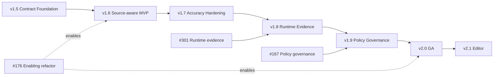

# ロードマップ

このロードマップは Version Release Train の正本サマリーです。実装の
source of truth は code・test・package とリンクされた Issue であり、個別の
Acceptance Criteria を置き換えません。

## 1. Product thesis

`cdn-security-framework` は **Application-aware Edge Security Compiler** です。
宣言 API、実装 source、許可 policy 面、実行時 evidence を比較し、人が
review した policy だけを CDN / edge / WAF artifact へ compile します。

CDN、WAF、DDoS、bot、CAPTCHA engine 自体を再実装しません。Product loop は
**Generate → Diff → Review → Apply** です。AI は finding の説明だけを行い、
Allow / Block / Severity / Exit を決定しません。

## 2. 4つの Truth と Evidence

| View | Source | 意味 |
| --- | --- | --- |
| Declared API | OpenAPI | チームが宣言した API |
| Implemented API | Source AST | source から静的に確認できる API |
| Allowed API | Security Policy / CDN / WAF | edge が許可するよう設定された面 |
| Observed Evidence | Runtime security event | 実行時に観測された security decision |

これらを暗黙に統合したり優先順位で上書きしたりしません。不一致は決定論的な
finding として返します。Runtime に観測がないことは route 削除・enforce の根拠に
ならず、guard がないことも public access の証明ではありません。

## 3. 現行リリースと main の状態

| Area | Status | Evidence / boundary |
| --- | --- | --- |
| 公開 package | v1.4.0 | [v1.4.0 tag](https://github.com/albert-einshutoin/cdn-security-framework/releases/tag/v1.4.0) |
| Contract / trust foundation (#271–#275) | Implemented | Finding、Security IR、parser/resource/privacy 境界 |
| OpenAPI-aware policy (#276–#284) | Implemented | safe loader、ref、normalization、inspect、review-only candidate |
| Declared ↔ allowed drift (#285–#293) | Implemented | exception、決定論的 report、SARIF、GitHub Actions |
| NestJS Source Analyzer core (#294–#300) | Implemented / Experimental | programmatic static analysis。application は実行しない |
| Source-aware standard CLI | Planned v1.6.0 | 現在の CLI は application source を自動読込しない |
| v1.5 release preparation | In progress / compatibility-blocked | [#529](https://github.com/albert-einshutoin/cdn-security-framework/issues/529)、[#555](https://github.com/albert-einshutoin/cdn-security-framework/issues/555) |

`Implemented` は code、acceptance evidence、package/docs evidence が揃った状態です。
`Experimental` は interface に到達できるが compatibility を保証しない状態です。

## 4. Version Release Train

| Version | Release epic | Outcome | Entry condition | Status |
| --- | --- | --- | --- | --- |
| v1.5.0 | [#529](https://github.com/albert-einshutoin/cdn-security-framework/issues/529) | 既実装の OpenAPI ↔ Policy Contract Foundation と release/package/docs hardening を productize | Entry、evidence、compatibility、package、security、RC review | **Blocked: #555 が breaking な policy compatibility 候補を検出** |
| v1.6.0 | `V160-REL-000` | CLI / CI / Public API の Source-aware Contract Diff MVP | v1.5 post-release review | Planned |
| v1.7.0 | `V170-REL-000` | pilot 駆動の accuracy、onboarding、monorepo hardening | v1.6 post-release review | Planned |
| v1.8.0 | `V180-REL-000` | Runtime Evidence preview | v1.7 post-release review | Planned |
| v1.9.0 | `V190-REL-000` | Policy governance / composition preview | v1.8 post-release review | Planned |
| v2.0.0 | `V200-REL-000` | Application-aware Security Compiler GA と stable public contract | v1.9 post-release review | Planned |
| v2.1.0 | `V210-REL-000` | LSP / VS Code editor feedback loop | v2.0 post-release review | Planned |

v1.5 の scope に新しい product feature は追加しません。Source-aware CLI、
Runtime Evidence、Policy Composition、LSP/VS Code、新しい analyzer、CDN/WAF
feature はこの release の外に置きます。

## 5. Version dependency graph

## 6. Review cadence と release gate

全 Version は同じ gate を通します。

1. Entry / evidence review（[#541](https://github.com/albert-einshutoin/cdn-security-framework/issues/541)）。
2. Compatibility / implementation audit（[#553](https://github.com/albert-einshutoin/cdn-security-framework/issues/553)、[#555](https://github.com/albert-einshutoin/cdn-security-framework/issues/555)）。
3. Repository、docs、API、Node/package、deterministic、security work（[#557](https://github.com/albert-einshutoin/cdn-security-framework/issues/557)、[#559](https://github.com/albert-einshutoin/cdn-security-framework/issues/559)、[#560](https://github.com/albert-einshutoin/cdn-security-framework/issues/560)、[#562](https://github.com/albert-einshutoin/cdn-security-framework/issues/562)、[#564](https://github.com/albert-einshutoin/cdn-security-framework/issues/564)、[#566](https://github.com/albert-einshutoin/cdn-security-framework/issues/566)、[#568](https://github.com/albert-einshutoin/cdn-security-framework/issues/568)）。
4. Midpoint status review（[#542](https://github.com/albert-einshutoin/cdn-security-framework/issues/542)）。
5. RC Go / No-Go review（[#544](https://github.com/albert-einshutoin/cdn-security-framework/issues/544)）。
6. Version bump、tag、publish は明示された RC decision の後だけに行い、その後 post-release review を行います。

v1.5 について #555 は、過去に有効だった v1.4 policy を拒否する schema
validator の厳格化と AWS CSP nonce fail-closed 化を記録しています。v1.5.0 の
release PR が version を上げる前に、major release へ再判定するか scope を縮小する
必要があります。

## 7. Status の定義

- **Implemented**: acceptance criteria と code/test/package evidence がある。
- **Operational hardening**: core はあるが release/package/docs または pilot evidence が不足。
- **Experimental**: 到達可能だが compatibility 保証を意図的に限定。
- **Planned**: Issue/spec が担当するが未リリース。
- **Research**: feasibility または adoption が未決定。

Issue を close しただけでは Status は変わりません。

## 8. Enabling lane と過去 track の対応

| 過去の作業 | 現在の行き先 |
| --- | --- |
| Cloudflare/auth と compiler test | 現行の implemented foundation / operational hardening |
| Issue と docs の整合 | 現行の docs/status governance |
| monitor/observability と multi-CDN parity | v1.7 accuracy / v1.8 Runtime Evidence |
| overlay/inheritance と governance helper | v1.9 Policy Governance |
| Stable API / provider 方針 | v2.0 GA |
| Rust/WASM と追加 CDN の調査 | Research backlog |

旧 Track A–G は履歴の説明であり、別の release plan ではありません。

## 9. 共通 release contract

各 release work item は [#529 release train](https://github.com/albert-einshutoin/cdn-security-framework/issues/529) に従います。1 Issue = 1 PR、明示的な input/output/error contract、normal/boundary/error/malicious test、privacy/resource limit、EN/JA docs、compatibility evidence、rollback 手順を必須にします。

Release evidence は次を示します。

- 決定論的な Contract / Finding / Report output。
- report/package に secret、raw request body/query、PII、developer の absolute path がないこと。
- provider capability 差と unknown/partial result が明示されること。
- clean npm install、supported Node matrix、API/CLI/package smoke、hosted CI。
- breaking schema または public API の判断には migration と rollback があること。

## 10. Status 更新ルール

Issue tracker を implementation source of truth とします。対応する Issue/PR/test/package
evidence が存在してからこの roadmap を更新します。英語版と日本語版は意味を一致させ、
全 release gate を owner にリンクし、future/experimental feature を Released と表現しません。
