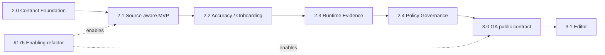

# ロードマップ

このロードマップは Version Release Train の正本サマリーです。実装の
source of truth は code・test・package とリンクされた Issue であり、個別の
Acceptance Criteria を置き換えません。

## 1. Product thesis

`cdn-security-framework` は **Application-aware Edge Security Compiler** です。
宣言 API、実装 source、許可 policy 面、実行時 evidence を比較し、人が
review した policy だけを CDN / edge / WAF artifact へ compile します。

CDN、WAF、DDoS、bot、CAPTCHA engine 自体を再実装しません。Product loop は
**Generate → Diff → Review → Apply** です。AI は finding の説明だけを行い、
Allow / Block / Severity / Exit を決定しません。

上記はProductの方向です。現在の比較経路とPlannedの境界は次の状態表を参照してください。

## 2. 4つの Truth と Evidence

| View | Source | 意味 |
| --- | --- | --- |
| Declared API | OpenAPI | チームが宣言した API |
| Implemented API | Source AST | source から静的に確認できる API |
| Allowed API | Security Policy / CDN / WAF | edge が許可するよう設定された面 |
| Observed Evidence | Runtime security event | 実行時に観測された security decision |

これらを暗黙に統合したり優先順位で上書きしたりしません。不一致は決定論的な
finding として返します。Runtime に観測がないことは route 削除・enforce の根拠に
ならず、guard がないことも public access の証明ではありません。

## 3. 現行リリースと main の状態

状態確認: **2026-09-22**、main `111f995bd35d3b24bdd1ee7dd72c35bce19f9170`。[main検証](https://github.com/albert-einshutoin/cdn-security-framework/issues/1023#issuecomment-5764409249)。schema2はmain実装済みですが未公開です。公開済み1.4.0、package表示1.4.0、次期目標2.0.0を区別します。

| Area | Status | Evidence / boundary |
| --- | --- | --- |
| Released package | v1.4.0 | [v1.4.0 tag](https://github.com/albert-einshutoin/cdn-security-framework/releases/tag/v1.4.0) |
| Contract / trust foundation (#271–#275) | Implemented | [Contract tests](https://github.com/albert-einshutoin/cdn-security-framework/tree/111f995bd35d3b24bdd1ee7dd72c35bce19f9170/test/contract/) / [Public contract](./programmatic-api.ja.md) |
| OpenAPI-aware policy (#276–#284) | Implemented | [OpenAPI tests](https://github.com/albert-einshutoin/cdn-security-framework/tree/111f995bd35d3b24bdd1ee7dd72c35bce19f9170/test/openapi/) / [OpenAPI guide](./openapi-integration.ja.md) |
| Declared ↔ allowed drift (#285–#293) | Implemented | [Drift tests](https://github.com/albert-einshutoin/cdn-security-framework/tree/111f995bd35d3b24bdd1ee7dd72c35bce19f9170/test/contract/contract-drift.test.ts) / [Reporters](https://github.com/albert-einshutoin/cdn-security-framework/tree/111f995bd35d3b24bdd1ee7dd72c35bce19f9170/test/reporters/) |
| NestJS Source Analyzer core (#294–#300) | Implemented / Experimental | [Source guide](./source-analysis-nestjs.ja.md); programmatic/static only |
| Source-aware standard CLI | Planned v2.1.0 | [#531](https://github.com/albert-einshutoin/cdn-security-framework/issues/531) |
| Policy schema 2 / migration | Implemented on main / unpublished | [#1023](https://github.com/albert-einshutoin/cdn-security-framework/issues/1023) / [PR #1033](https://github.com/albert-einshutoin/cdn-security-framework/pull/1033) |
| v2.0 release preparation | Operational hardening / not RC GO | [#529](https://github.com/albert-einshutoin/cdn-security-framework/issues/529) / [#895](https://github.com/albert-einshutoin/cdn-security-framework/issues/895) |

## 4. Version Release Train

| Version | Release epic | Outcome / must-have | Entry condition | Non-goals | Status |
| --- | --- | --- | --- | --- | --- |
| v2.0.0 | [#529](https://github.com/albert-einshutoin/cdn-security-framework/issues/529) | Contract Foundation / schema 2 / 安全なmigration | [#541](https://github.com/albert-einshutoin/cdn-security-framework/issues/541) / [#1013](https://github.com/albert-einshutoin/cdn-security-framework/issues/1013) Decision A | Source CLI / Runtime / Composition / Editor | Operational hardening |
| v2.1.0 | [#531](https://github.com/albert-einshutoin/cdn-security-framework/issues/531) | Source-aware Contract Diff MVP | [#545](https://github.com/albert-einshutoin/cdn-security-framework/issues/545) | Runtime / Composition / Editor | Planned |
| v2.2.0 | [#533](https://github.com/albert-einshutoin/cdn-security-framework/issues/533) | 精度 / onboarding / monorepo改善 | [#531](https://github.com/albert-einshutoin/cdn-security-framework/issues/531) 公開後評価 | New analyzers/providers | Planned |
| v2.3.0 | [#534](https://github.com/albert-einshutoin/cdn-security-framework/issues/534) | Runtime Evidence Preview | [#533](https://github.com/albert-einshutoin/cdn-security-framework/issues/533) 公開後評価 | Automatic enforcement | Planned |
| v2.4.0 | [#536](https://github.com/albert-einshutoin/cdn-security-framework/issues/536) | Policy Governance Preview | [#534](https://github.com/albert-einshutoin/cdn-security-framework/issues/534) 公開後評価 | Silent baseline weakening | Planned |
| v3.0.0 | [#537](https://github.com/albert-einshutoin/cdn-security-framework/issues/537) | GA public contract | [#536](https://github.com/albert-einshutoin/cdn-security-framework/issues/536) 公開後評価 | Editor extension | Planned |
| v3.1.0 | [#539](https://github.com/albert-einshutoin/cdn-security-framework/issues/539) | Editor連携 | [#537](https://github.com/albert-einshutoin/cdn-security-framework/issues/537) 公開後評価 | Automatic apply/deploy | Planned |

公開日を約束しません。各Epicがscope・受入条件の正本です。旧V150等のIDは履歴のまま残します。

## 5. Version dependency graph

## 6. Review cadence と release gate

1. Entry / evidence review: [#541](https://github.com/albert-einshutoin/cdn-security-framework/issues/541).
2. Current candidate audits: [#887](https://github.com/albert-einshutoin/cdn-security-framework/issues/887), [#889](https://github.com/albert-einshutoin/cdn-security-framework/issues/889), [#891](https://github.com/albert-einshutoin/cdn-security-framework/issues/891), [#890](https://github.com/albert-einshutoin/cdn-security-framework/issues/890), [#1024](https://github.com/albert-einshutoin/cdn-security-framework/issues/1024).
3. Midpoint / implementation-status review: [#542](https://github.com/albert-einshutoin/cdn-security-framework/issues/542).
4. RC GO/NO-GO: [#895](https://github.com/albert-einshutoin/cdn-security-framework/issues/895).
5. Version change / release preparation / separately approved publication: [#571](https://github.com/albert-einshutoin/cdn-security-framework/issues/571).
6. Post-release outcome review: [#545](https://github.com/albert-einshutoin/cdn-security-framework/issues/545).

[#1013](https://github.com/albert-einshutoin/cdn-security-framework/issues/1013) Decision Aはmajor再分類を確定済みです。Stable v1.5.0 NO-GO（[#544](https://github.com/albert-einshutoin/cdn-security-framework/issues/544)）と旧監査[#555](https://github.com/albert-einshutoin/cdn-security-framework/issues/555)は履歴として保持し、新候補の受入を代用しません。#895のGO、#571のversion変更・release PR、tag/npm公開、Issue closeは別状態です。schema2のmain反映だけでは公開可能とは判断しません。

## 7. Status の定義

- **Implemented**: acceptance criteria と code/test/package evidence がある。
- **Operational hardening**: core はあるが release/package/docs または pilot evidence が不足。
- **Experimental**: 到達可能だが compatibility 保証を意図的に限定。
- **Planned**: Issue/spec が担当するが未リリース。
- **Research**: feasibility または adoption が未決定。

Issue を close しただけでは Status は変わりません。

## 8. Enabling lane と過去 track の対応

| 過去の作業 | 現在の行き先 |
| --- | --- |
| Cloudflare/auth と compiler test | 現行の implemented foundation / operational hardening |
| Issue と docs の整合 | 現行の docs/status governance |
| monitor/observability と multi-CDN parity | v2.2 accuracy / v2.3 Runtime Evidence |
| overlay/inheritance と governance helper | v2.4 Policy Governance |
| Stable API / provider 方針 | v3.0 GA |
| Rust/WASM と追加 CDN の調査 | Research backlog |

旧 Track A–G は履歴の説明であり、別の release plan ではありません。

## 9. 共通 release contract

各 release work item は [#529 release train](https://github.com/albert-einshutoin/cdn-security-framework/issues/529) に従います。1 Issue = 1 PR、明示的な input/output/error contract、normal/boundary/error/malicious test、privacy/resource limit、EN/JA docs、compatibility evidence、rollback 手順を必須にします。

Release evidence は次を示します。

- 決定論的な Contract / Finding / Report output。
- report/package に secret、raw request body/query、PII、developer の absolute path がないこと。
- provider capability 差と unknown/partial result が明示されること。
- clean npm install、supported Node matrix、API/CLI/package smoke、hosted CI。
- breaking schema または public API の判断には migration と rollback があること。

## 10. Status 更新ルール

Issue tracker を implementation source of truth とします。対応する Issue/PR/test/package
evidence が存在してからこの roadmap を更新します。英語版と日本語版は意味を一致させ、
全 release gate を owner にリンクし、future/experimental feature を Released と表現しません。
