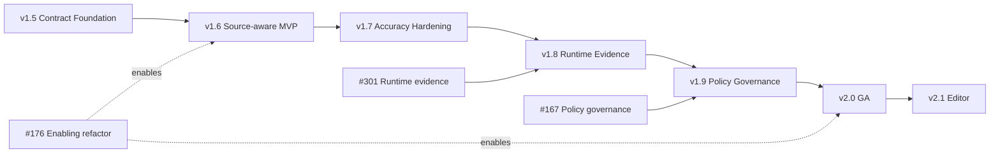

# Roadmap

This roadmap is the canonical summary of the version release train. The
implementation source of truth is the code, tests, package, and linked Issues;
this document does not replace their acceptance criteria.

## 1. Product thesis

`cdn-security-framework` is an **Application-aware Edge Security Compiler**.
It compares declared API, implemented source, allowed policy surface, and
observed runtime evidence, then compiles only reviewed policy into CDN/edge/WAF
artifacts.

The framework does not reimplement a CDN, WAF, DDoS, bot, or CAPTCHA engine.
The product loop is **Generate → Diff → Review → Apply**. AI may explain a
finding, but it never decides Allow/Block/Severity/Exit.

## 2. Four truths and evidence

| View | Source | Meaning |
| --- | --- | --- |
| Declared API | OpenAPI | API the team declares |
| Implemented API | Source AST | API statically found in source |
| Allowed API | Security Policy / CDN / WAF | Surface the edge is configured to allow |
| Observed Evidence | Runtime security event | Security decisions observed at runtime |

These views are not silently merged or ordered. A mismatch is a deterministic
finding. Runtime absence is not proof that a route can be deleted or enforced,
and an absent guard is not proof of public access.

## 3. Current release and main status

| Area | Status | Evidence / boundary |
| --- | --- | --- |
| Released package | v1.4.0 | [v1.4.0 tag](https://github.com/albert-einshutoin/cdn-security-framework/releases/tag/v1.4.0) |
| Contract / trust foundation (#271–#275) | Implemented | Finding, Security IR, parser/resource/privacy boundaries |
| OpenAPI-aware policy (#276–#284) | Implemented | Safe loader, refs, normalization, inspect, review-only candidate |
| Declared ↔ allowed drift (#285–#293) | Implemented | Exceptions, deterministic reports, SARIF, GitHub Actions |
| NestJS Source Analyzer core (#294–#300) | Implemented / Experimental | Programmatic static analysis; no application execution |
| Source-aware standard CLI | Planned v1.6.0 | Current CLI does not load application source automatically |
| v1.5 release preparation | In progress / compatibility-blocked | [#529](https://github.com/albert-einshutoin/cdn-security-framework/issues/529), [#555](https://github.com/albert-einshutoin/cdn-security-framework/issues/555) |

`Implemented` means code, acceptance evidence, and package/docs evidence
exist. `Experimental` means the interface is reachable but compatibility is
not yet guaranteed.

## 4. Version release train

| Version | Release epic | Outcome | Entry condition | Status |
| --- | --- | --- | --- | --- |
| v1.5.0 | [#529](https://github.com/albert-einshutoin/cdn-security-framework/issues/529) | Productize the existing OpenAPI ↔ Policy Contract Foundation and release/package/docs hardening | Entry, evidence, compatibility, package, security, and RC reviews | **Blocked: #555 found breaking policy compatibility candidates** |
| v1.6.0 | `V160-REL-000` | Source-aware Contract Diff MVP in CLI/CI/Public API | v1.5 post-release review | Planned |
| v1.7.0 | `V170-REL-000` | Pilot-driven accuracy, onboarding, and monorepo hardening | v1.6 post-release review | Planned |
| v1.8.0 | `V180-REL-000` | Runtime Evidence preview | v1.7 post-release review | Planned |
| v1.9.0 | `V190-REL-000` | Policy governance and composition preview | v1.8 post-release review | Planned |
| v2.0.0 | `V200-REL-000` | Application-aware Security Compiler GA and stable public contract | v1.9 post-release review | Planned |
| v2.1.0 | `V210-REL-000` | LSP / VS Code editor feedback loop | v2.0 post-release review | Planned |

The v1.5 scope adds no new product feature. Source-aware CLI, Runtime
Evidence, Policy Composition, LSP/VS Code, new analyzers, and new CDN/WAF
features stay outside that release.

## 5. Version dependency graph

## 6. Review cadence and release gates

Every version follows the same gates:

1. Entry / evidence review ([#541](https://github.com/albert-einshutoin/cdn-security-framework/issues/541)).
2. Compatibility and implementation audits ([#553](https://github.com/albert-einshutoin/cdn-security-framework/issues/553), [#555](https://github.com/albert-einshutoin/cdn-security-framework/issues/555)).
3. Repository, docs, API, Node/package, deterministic, and security work ([#557](https://github.com/albert-einshutoin/cdn-security-framework/issues/557), [#559](https://github.com/albert-einshutoin/cdn-security-framework/issues/559), [#560](https://github.com/albert-einshutoin/cdn-security-framework/issues/560), [#562](https://github.com/albert-einshutoin/cdn-security-framework/issues/562), [#564](https://github.com/albert-einshutoin/cdn-security-framework/issues/564), [#566](https://github.com/albert-einshutoin/cdn-security-framework/issues/566), [#568](https://github.com/albert-einshutoin/cdn-security-framework/issues/568)).
4. Midpoint status review ([#542](https://github.com/albert-einshutoin/cdn-security-framework/issues/542)).
5. RC Go/No-Go review ([#544](https://github.com/albert-einshutoin/cdn-security-framework/issues/544)).
6. Release Issue/PR contract ([#571](https://github.com/albert-einshutoin/cdn-security-framework/issues/571)).
7. Version bump, tag, and publish only after an explicit RC decision; then post-release review.

For v1.5, #555 records that a schema validator tightening and AWS CSP nonce
fail-closed change reject some previously valid v1.4 policies. The release
must be reclassified as a major release or narrowed before a v1.5.0 release PR
may bump the version.

## 7. Status definitions

- **Implemented**: acceptance criteria and code/test/package evidence are present.
- **Operational hardening**: core behavior exists, but release/package/docs or pilot evidence is incomplete.
- **Experimental**: reachable interface with deliberately limited compatibility guarantees.
- **Planned**: owned by an Issue/spec but not released.
- **Research**: feasibility or adoption is not decided.

Closing an Issue alone never changes its status.

## 8. Enabling lanes and historical track mapping

| Historical work | Current destination |
| --- | --- |
| Cloudflare/auth and compiler test tracks | Current implemented foundation and operational hardening |
| Issue-to-docs alignment | Current docs/status governance |
| Monitor/observability and multi-CDN parity | v1.7 accuracy and v1.8 Runtime Evidence |
| Overlay/inheritance and governance helpers | v1.9 Policy Governance |
| Stable API/provider direction | v2.0 GA |
| Rust/WASM and additional CDN research | Research backlog |

The old Track A–G layout is historical context, not a second release plan.

## 9. Common release contract

Each release work item follows the [#529 release train](https://github.com/albert-einshutoin/cdn-security-framework/issues/529): one Issue = one PR, explicit input/output/error contracts, normal/boundary/error/malicious tests, privacy and resource limits, EN/JA documentation, compatibility evidence, and rollback instructions.

Release evidence must show:

- deterministic Contract/Finding/Report output;
- no secret, raw request body/query, PII, or developer absolute path in reports or packages;
- provider capability differences and unknown/partial results explicitly preserved;
- clean npm install, supported Node matrix, API/CLI/package smoke, and hosted CI;
- migration and rollback for any breaking schema or public API decision.

## 10. Status update rules

The Issue tracker is the implementation source of truth. Update this roadmap
only after the corresponding Issue/PR/test/package evidence exists. Keep the
English and Japanese files semantically equivalent, link every release gate to
its owner, and never promote a future or experimental feature to Released.
