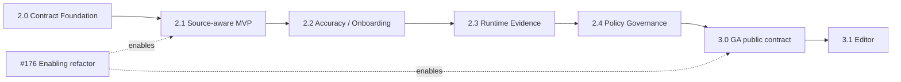

# Roadmap

This roadmap is the canonical summary of the version release train. The
implementation source of truth is the code, tests, package, and linked Issues;
this document does not replace their acceptance criteria.

## 1. Product thesis

`cdn-security-framework` is an **Application-aware Edge Security Compiler**.
It compares declared API, implemented source, allowed policy surface, and
observed runtime evidence, then compiles only reviewed policy into CDN/edge/WAF
artifacts.

The framework does not reimplement a CDN, WAF, DDoS, bot, or CAPTCHA engine.
The product loop is **Generate → Diff → Review → Apply**. AI may explain a
finding, but it never decides Allow/Block/Severity/Exit.

This is the product direction; the status table below bounds the current comparison paths and planned capabilities.

## 2. Four truths and evidence

| View | Source | Meaning |
| --- | --- | --- |
| Declared API | OpenAPI | API the team declares |
| Implemented API | Source AST | API statically found in source |
| Allowed API | Security Policy / CDN / WAF | Surface the edge is configured to allow |
| Observed Evidence | Runtime security event | Security decisions observed at runtime |

These views are not silently merged or ordered. A mismatch is a deterministic
finding. Runtime absence is not proof that a route can be deleted or enforced,
and an absent guard is not proof of public access.

## 3. Current release and main status

Status checked **2026-09-22**, main `111f995bd35d3b24bdd1ee7dd72c35bce19f9170`. [Main validation](https://github.com/albert-einshutoin/cdn-security-framework/issues/1023#issuecomment-5764409249). Schema2 is implemented on main but unpublished. Published1.4.0, the retained package version1.4.0, and the next target2.0.0 are distinct.

| Area | Status | Evidence / boundary |
| --- | --- | --- |
| Released package | v1.4.0 | [v1.4.0 tag](https://github.com/albert-einshutoin/cdn-security-framework/releases/tag/v1.4.0) |
| Contract / trust foundation (#271–#275) | Implemented | [Contract tests](https://github.com/albert-einshutoin/cdn-security-framework/tree/111f995bd35d3b24bdd1ee7dd72c35bce19f9170/test/contract/) / [Public contract](./programmatic-api.md) |
| OpenAPI-aware policy (#276–#284) | Implemented | [OpenAPI tests](https://github.com/albert-einshutoin/cdn-security-framework/tree/111f995bd35d3b24bdd1ee7dd72c35bce19f9170/test/openapi/) / [OpenAPI guide](./openapi-integration.md) |
| Declared ↔ allowed drift (#285–#293) | Implemented | [Drift tests](https://github.com/albert-einshutoin/cdn-security-framework/tree/111f995bd35d3b24bdd1ee7dd72c35bce19f9170/test/contract/contract-drift.test.ts) / [Reporters](https://github.com/albert-einshutoin/cdn-security-framework/tree/111f995bd35d3b24bdd1ee7dd72c35bce19f9170/test/reporters/) |
| NestJS Source Analyzer core (#294–#300) | Implemented / Experimental | [Source guide](./source-analysis-nestjs.md); programmatic/static only |
| Source-aware standard CLI | Planned v2.1.0 | [#531](https://github.com/albert-einshutoin/cdn-security-framework/issues/531) |
| Policy schema 2 / migration | Implemented on main / unpublished | [#1023](https://github.com/albert-einshutoin/cdn-security-framework/issues/1023) / [PR #1033](https://github.com/albert-einshutoin/cdn-security-framework/pull/1033) |
| v2.0 release preparation | Operational hardening / not RC GO | [#529](https://github.com/albert-einshutoin/cdn-security-framework/issues/529) / [#895](https://github.com/albert-einshutoin/cdn-security-framework/issues/895) |

## 4. Version release train

| Version | Release epic | Outcome / must-have | Entry condition | Non-goals | Status |
| --- | --- | --- | --- | --- | --- |
| v2.0.0 | [#529](https://github.com/albert-einshutoin/cdn-security-framework/issues/529) | Contract Foundation / schema 2 / safe migration | [#541](https://github.com/albert-einshutoin/cdn-security-framework/issues/541) / [#1013](https://github.com/albert-einshutoin/cdn-security-framework/issues/1013) Decision A | Source CLI / Runtime / Composition / Editor | Operational hardening |
| v2.1.0 | [#531](https://github.com/albert-einshutoin/cdn-security-framework/issues/531) | Source-aware Contract Diff MVP | [#545](https://github.com/albert-einshutoin/cdn-security-framework/issues/545) | Runtime / Composition / Editor | Planned |
| v2.2.0 | [#533](https://github.com/albert-einshutoin/cdn-security-framework/issues/533) | Accuracy / onboarding / monorepo hardening | [#531](https://github.com/albert-einshutoin/cdn-security-framework/issues/531) post-release review | New analyzers/providers | Planned |
| v2.3.0 | [#534](https://github.com/albert-einshutoin/cdn-security-framework/issues/534) | Runtime Evidence Preview | [#533](https://github.com/albert-einshutoin/cdn-security-framework/issues/533) post-release review | Automatic enforcement | Planned |
| v2.4.0 | [#536](https://github.com/albert-einshutoin/cdn-security-framework/issues/536) | Policy Governance Preview | [#534](https://github.com/albert-einshutoin/cdn-security-framework/issues/534) post-release review | Silent baseline weakening | Planned |
| v3.0.0 | [#537](https://github.com/albert-einshutoin/cdn-security-framework/issues/537) | GA public contract | [#536](https://github.com/albert-einshutoin/cdn-security-framework/issues/536) post-release review | Editor extension | Planned |
| v3.1.0 | [#539](https://github.com/albert-einshutoin/cdn-security-framework/issues/539) | Editor integration | [#537](https://github.com/albert-einshutoin/cdn-security-framework/issues/537) post-release review | Automatic apply/deploy | Planned |

No delivery dates are promised. Each epic owns scope and acceptance. Old V150 identifiers remain historical references.

## 5. Version dependency graph

## 6. Review cadence and release gates

1. Entry / evidence review: [#541](https://github.com/albert-einshutoin/cdn-security-framework/issues/541).
2. Current candidate audits: [#887](https://github.com/albert-einshutoin/cdn-security-framework/issues/887), [#889](https://github.com/albert-einshutoin/cdn-security-framework/issues/889), [#891](https://github.com/albert-einshutoin/cdn-security-framework/issues/891), [#890](https://github.com/albert-einshutoin/cdn-security-framework/issues/890), [#1024](https://github.com/albert-einshutoin/cdn-security-framework/issues/1024).
3. Midpoint / implementation-status review: [#542](https://github.com/albert-einshutoin/cdn-security-framework/issues/542).
4. RC GO/NO-GO: [#895](https://github.com/albert-einshutoin/cdn-security-framework/issues/895).
5. Version change / release preparation / separately approved publication: [#571](https://github.com/albert-einshutoin/cdn-security-framework/issues/571).
6. Post-release outcome review: [#545](https://github.com/albert-einshutoin/cdn-security-framework/issues/545).

[#1013](https://github.com/albert-einshutoin/cdn-security-framework/issues/1013) Decision A adopted major reclassification. Stable v1.5.0 NO-GO ([#544](https://github.com/albert-einshutoin/cdn-security-framework/issues/544)) and old audit [#555](https://github.com/albert-einshutoin/cdn-security-framework/issues/555) remain historical evidence, not acceptance of the new candidate. #895 GO, #571 version changes/release PR, tag/npm publication, and Issue close are separate states. Schema2 on main alone does not mean ready to publish.

## 7. Status definitions

- **Implemented**: acceptance criteria and code/test/package evidence are present.
- **Operational hardening**: core behavior exists, but release/package/docs or pilot evidence is incomplete.
- **Experimental**: reachable interface with deliberately limited compatibility guarantees.
- **Planned**: owned by an Issue/spec but not released.
- **Research**: feasibility or adoption is not decided.

Closing an Issue alone never changes its status.

## 8. Enabling lanes and historical track mapping

| Historical work | Current destination |
| --- | --- |
| Cloudflare/auth and compiler test tracks | Current implemented foundation and operational hardening |
| Issue-to-docs alignment | Current docs/status governance |
| Monitor/observability and multi-CDN parity | v2.2 accuracy and v2.3 Runtime Evidence |
| Overlay/inheritance and governance helpers | v2.4 Policy Governance |
| Stable API/provider direction | v3.0 GA |
| Rust/WASM and additional CDN research | Research backlog |

The old Track A–G layout is historical context, not a second release plan.

## 9. Common release contract

Each release work item follows the [#529 release train](https://github.com/albert-einshutoin/cdn-security-framework/issues/529): one Issue = one PR, explicit input/output/error contracts, normal/boundary/error/malicious tests, privacy and resource limits, EN/JA documentation, compatibility evidence, and rollback instructions.

Release evidence must show:

- deterministic Contract/Finding/Report output;
- no secret, raw request body/query, PII, or developer absolute path in reports or packages;
- provider capability differences and unknown/partial results explicitly preserved;
- clean npm install, supported Node matrix, API/CLI/package smoke, and hosted CI;
- migration and rollback for any breaking schema or public API decision.

## 10. Status update rules

The Issue tracker is the implementation source of truth. Update this roadmap
only after the corresponding Issue/PR/test/package evidence exists. Keep the
English and Japanese files semantically equivalent, link every release gate to
its owner, and never promote a future or experimental feature to Released.
