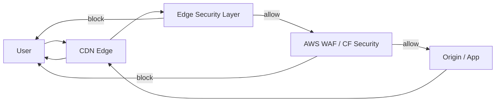

## アーキテクチャ概要

本フレームワークは **"Policy → Compile → Runtime"** の三層構造で設計されています。

---

## 全体フロー



---

## レイヤー別責務

### Edge Security Layer

対象:

* CloudFront Functions
* Cloudflare Workers

責務:

* Method / Path / UA の粗い検査
* クエリ正規化・削除
* 早期遮断（403/400）
* セキュリティヘッダー付与

特徴:

* 超低レイテンシ
* ステートレス

---

### WAF Layer

対象:

* AWS WAF
* Cloudflare WAF

責務:

* レート制限
* OWASP Managed Rules
* Bot / CAPTCHA
* Body 検査

特徴:

* ステートフル
* 高精度

---

### Origin / Application

責務:

* 認証 / 認可
* 業務ロジック
* データ整合性

> 「Edge が壊れても App が最後の砦になる」前提を維持する

---

## ポリシー駆動設計

```mermaid
flowchart TB
  P[Security Policy
(YAML)] --> C[Compiler]
  C --> CF[CloudFront Functions]
  C --> LE[Lambda@Edge]
  C --> CW[Cloudflare Workers]
```

### ポリシーの役割

* 人がレビューできる
* PR で差分が分かる
* CDN 依存を排除

---

## CDN別実装マッピング

| 概念     | CloudFront Functions | Lambda@Edge     | Cloudflare Workers |
| ------ | -------------------- | --------------- | ------------------ |
| 入口遮断   | Viewer Request       | Origin Request  | fetch()            |
| ヘッダー付与 | Viewer Response      | Origin Response | Response headers   |
| 高度検証   | 不可                   | 可能              | 可能                 |
| 状態管理   | 不可                   | 一部可             | KV / DO            |

---

## セキュリティ設計原則

1. **Fail Fast** – 早く落とす
2. **Least Privilege** – 通さない前提
3. **Defense in Depth** – Edge + WAF + App
4. **Portable Security** – CDN に依存しない

---

## よくあるアンチパターン

* Edge だけで全てを守ろうとする
* WAF ルールと Functions が重複
* CSP をいきなり厳格化
* 例外ルールが増殖

---

## この設計が向いているケース

* グローバル配信
* API + 管理画面
* マルチテナント
* OSS / テンプレ配布

---

## 次のステップ

* [threat-model.ja.md](threat-model.ja.md) で攻撃整理
* [decision-matrix.ja.md](decision-matrix.ja.md) で Edge / WAF 判断
* ポリシーとランタイムの同期: [policy-runtime-sync.ja.md](policy-runtime-sync.ja.md)
* 観測: [observability.ja.md](observability.ja.md) でログ・メトリクス仕様
* CI で policy lint / ランタイムテスト: `.github/workflows/policy-lint.yml`