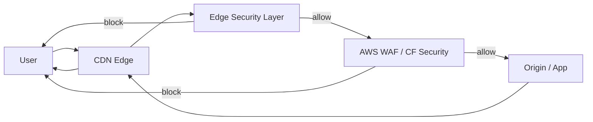

## アーキテクチャ概要

Release scope と capability status の正本は[version roadmap](./ROADMAP.ja.md)です。

本フレームワークは **"Policy → Compile → Runtime"** の三層構造で設計されています。

## プロダクト境界と Evidence

本プロダクトは **Application-aware Edge Security Compiler** です。
アプリケーションが宣言した意図とレビュー済み policy を provider 別の Edge / WAF
artifact に変換します。CDN / WAF の動作やアプリケーション認証認可を再実装しません。
運用の流れは **Generate → Diff → Review → Apply** です。

4つの独立した Truth を分離して扱います。

| Truth | Evidence | 何を示せるか |
| --- | --- | --- |
| Declared | OpenAPI | contract が公開すると宣言したもの |
| Implemented | Source AST / Source IR | 対応済み source syntax が宣言するもの |
| Allowed | Policy と CDN/WAF 設定 | security policy が許可するもの |
| Observed | Runtime evidence | deploy 済み system が実際に出力・受理したもの |

どの Truth も別の Truth の証明とは扱いません。未対応・partial な解析は推測で
補完せず、review 用 finding として報告します。

### Capability status

| Capability | Status | Interface | Limit |
| --- | --- | --- | --- |
| OpenAPI inspect | Implemented | CLI/API | local refs only |
| OpenAPI policy candidate | Implemented | CLI/API | review-only; never auto-applied |
| OpenAPI↔Policy drift | Implemented | CLI/JSON/SARIF/GHA | no source needed |
| NestJS Source Analyzer core | Experimental/Implemented core | Programmatic | no app execution; metadata is not enforcement proof |
| Source-aware contract diff CLI | Planned v1.6 | — | — |
| Runtime Evidence v1 | Planned v1.8 | — | — |
| Policy Composition | Planned v1.9 | — | — |
| LSP/VS Code | Planned v2.1 | — | — |

対応済み interface は [OpenAPI 導入ガイド](openapi-integration.ja.md)、
[NestJS Source Analysis](source-analysis-nestjs.ja.md)、[CLI リファレンス](cli.ja.md)、
[プログラマティック API](programmatic-api.ja.md) を参照してください。
Source-aware contract diff CLI は v1.6 planned のままで、現行 NestJS analyzer は
programmatic かつ static のみです。

---

## 全体フロー

```mermaid
flowchart LR
  U[User]
  CDN[CDN Edge]
  SEC[Edge Security Layer]
  WAF[AWS WAF / CF Security]
  ORI[Origin / App]

  U --> CDN
  CDN --> SEC
  SEC -->|block| U
  SEC -->|allow| WAF
  WAF -->|block| U
  WAF -->|allow| ORI
  ORI --> CDN --> U
```

---

## レイヤー別責務

### Edge Security Layer

対象:

* CloudFront Functions
* Cloudflare Workers

責務:

* Method / Path / UA の粗い検査
* クエリ正規化・削除
* 早期遮断（403/400）
* セキュリティヘッダー付与

特徴:

* 超低レイテンシ
* ステートレス

---

### WAF Layer

対象:

* AWS WAF
* Cloudflare WAF

責務:

* レート制限
* OWASP Managed Rules
* Bot / CAPTCHA
* Body 検査

特徴:

* ステートフル
* 高精度

---

### Origin / Application

責務:

* 認証 / 認可
* 業務ロジック
* データ整合性

> 「Edge が壊れても App が最後の砦になる」前提を維持する

---

## ポリシー駆動設計

```mermaid
flowchart TB
  P[Security Policy
(YAML)] --> C[Compiler]
  C --> CF[CloudFront Functions]
  C --> LE[Lambda@Edge]
  C --> CW[Cloudflare Workers]
```

### ポリシーの役割

* 人がレビューできる
* PR で差分が分かる
* CDN 依存を排除

---

## CDN別実装マッピング

| 概念     | CloudFront Functions | Lambda@Edge     | Cloudflare Workers |
| ------ | -------------------- | --------------- | ------------------ |
| 入口遮断   | Viewer Request       | Origin Request  | fetch()            |
| ヘッダー付与 | Viewer Response      | Origin Response | Response headers   |
| 高度検証   | 不可                   | 可能              | 可能                 |
| 状態管理   | 不可                   | 一部可             | KV / DO            |

---

## セキュリティ設計原則

1. **Fail Fast** – 早く落とす
2. **Least Privilege** – 通さない前提
3. **Defense in Depth** – Edge + WAF + App
4. **Portable Security** – CDN に依存しない

将来の Security Compiler 比較（段階的提供を計画中）は Declared、Implemented、
Allowed、Observed API を対象とし、いずれか1つを常に正とは扱いません。詳細は
[ADR 0003: Security ContractのTrust Model](adr/0003-security-contract-trust-model.ja.md)を参照してください。

---

## よくあるアンチパターン

* Edge だけで全てを守ろうとする
* WAF ルールと Functions が重複
* CSP をいきなり厳格化
* 例外ルールが増殖

---

## この設計が向いているケース

* グローバル配信
* API + 管理画面
* マルチテナント
* OSS / テンプレ配布

---

## 次のステップ

* [threat-model.ja.md](threat-model.ja.md) で攻撃整理
* [decision-matrix.ja.md](decision-matrix.ja.md) で Edge / WAF 判断
* ポリシーとランタイムの同期: [policy-runtime-sync.ja.md](policy-runtime-sync.ja.md)
* 観測: [observability.ja.md](observability.ja.md) でログ・メトリクス仕様
* CI 品質ゲート（policy lint + build + runtime + unit + drift + security-baseline）: `.github/workflows/policy-lint.yml`
