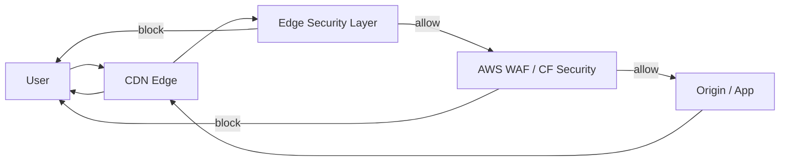

## Architecture Overview

This framework is designed with a three-layer structure: **"Policy → Compile → Runtime"**.

---

## Overall Flow



---

## Layer Responsibilities

### Edge Security Layer

Target:

* CloudFront Functions
* Cloudflare Workers

Responsibilities:

* Coarse inspection of Method / Path / User-Agent
* Query normalization and removal
* Early blocking (403/400)
* Security header injection

Characteristics:

* Ultra-low latency
* Stateless

---

### WAF Layer

Target:

* AWS WAF
* Cloudflare WAF

Responsibilities:

* Rate limiting
* OWASP Managed Rules
* Bot / CAPTCHA
* Body inspection

Characteristics:

* Stateful
* High precision

---

### Origin / Application

Responsibilities:

* Authentication / Authorization
* Business logic
* Data integrity

> Maintain the premise that "even if Edge fails, the App remains the last line of defense"

---

## Policy-Driven Design

```mermaid
flowchart TB
  P[Security Policy
(YAML)] --> C[Compiler]
  C --> CF[CloudFront Functions]
  C --> LE[Lambda@Edge]
  C --> CW[Cloudflare Workers]
```

### Role of Policy

* Human-reviewable
* Diffs visible in PRs
* CDN-agnostic

---

## CDN Implementation Mapping

| Concept       | CloudFront Functions | Lambda@Edge     | Cloudflare Workers |
| ------------- | -------------------- | --------------- | ------------------ |
| Entry blocking | Viewer Request       | Origin Request  | fetch()            |
| Header injection | Viewer Response      | Origin Response | Response headers   |
| Advanced validation | Not supported        | Supported       | Supported          |
| State management | Not supported        | Partially       | KV / DO            |

---

## Security Design Principles

1. **Fail Fast** – Block early
2. **Least Privilege** – Deny by default
3. **Defense in Depth** – Edge + WAF + App
4. **Portable Security** – CDN-independent

---

## Common Anti-Patterns

* Relying on Edge alone for all protection
* Overlapping WAF rules and Functions
* Tightening CSP abruptly
* Proliferation of exception rules

---

## Use Cases This Design Fits

* Global distribution
* API + admin UI
* Multi-tenant
* OSS / template distribution

---

## Next Steps

* Organize threats in [threat-model.md](threat-model.md)
* Use [decision-matrix.md](decision-matrix.md) for Edge / WAF decisions
* Keep policy and runtimes in sync: [policy-runtime-sync.md](policy-runtime-sync.md)
* Observability: [observability.md](observability.md) for logging and metrics
* Policy lint and runtime tests in CI: `.github/workflows/policy-lint.yml`
