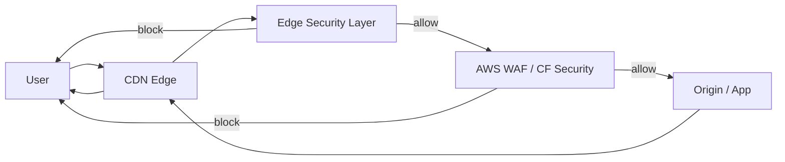

## Architecture Overview

The [version roadmap](./ROADMAP.md) is the canonical source for release scope
and capability status.

This framework is designed with a three-layer structure: **"Policy → Compile → Runtime"**.

## Product Boundary and Evidence

The product is an **Application-aware Edge Security Compiler**. It compiles
declared application intent and reviewed policy into provider-specific edge and
WAF artifacts; it does not reimplement CDN/WAF behavior or application
authorization. The operating loop is **Generate → Diff → Review → Apply**.

Four independent truths are kept separate:

| Truth | Evidence | What it can establish |
| --- | --- | --- |
| Declared | OpenAPI | What the contract says is exposed |
| Implemented | Source AST / Source IR | What supported source syntax declares |
| Allowed | Policy and CDN/WAF configuration | What the security policy permits |
| Observed | Runtime evidence | What a deployed system actually emitted or accepted |

No truth is treated as proof of another. Unsupported or partial analysis is
reported as a finding for review rather than filled in by an assumption.

### Capability status

| Capability | Status | Interface | Limit |
| --- | --- | --- | --- |
| OpenAPI inspect | Implemented | CLI/API | local refs only |
| OpenAPI policy candidate | Implemented | CLI/API | review-only; never auto-applied |
| OpenAPI↔Policy drift | Implemented | CLI/JSON/SARIF/GHA | no source needed |
| NestJS Source Analyzer core | Experimental/Implemented core | Programmatic | no app execution; metadata is not enforcement proof |
| Source-aware contract diff CLI | Planned v1.6 | — | — |
| Runtime Evidence v1 | Planned v1.8 | — | — |
| Policy Composition | Planned v1.9 | — | — |
| LSP/VS Code | Planned v2.1 | — | — |

Use the [OpenAPI integration guide](openapi-integration.md), [NestJS source
analysis guide](source-analysis-nestjs.md), [CLI reference](cli.md), and
[Programmatic API](programmatic-api.md) for the supported interfaces. The
Source-aware contract diff CLI remains planned for v1.6; the current NestJS
analyzer is programmatic and static only.

---

## Overall Flow

```mermaid
flowchart LR
  U[User]
  CDN[CDN Edge]
  SEC[Edge Security Layer]
  WAF[AWS WAF / CF Security]
  ORI[Origin / App]

  U --> CDN
  CDN --> SEC
  SEC -->|block| U
  SEC -->|allow| WAF
  WAF -->|block| U
  WAF -->|allow| ORI
  ORI --> CDN --> U
```

---

## Layer Responsibilities

### Edge Security Layer

Target:

* CloudFront Functions
* Cloudflare Workers

Responsibilities:

* Coarse inspection of Method / Path / User-Agent
* Query normalization and removal
* Early blocking (403/400)
* Security header injection

Characteristics:

* Ultra-low latency
* Stateless

---

### WAF Layer

Target:

* AWS WAF
* Cloudflare WAF

Responsibilities:

* Rate limiting
* OWASP Managed Rules
* Bot / CAPTCHA
* Body inspection

Characteristics:

* Stateful
* High precision

---

### Origin / Application

Responsibilities:

* Authentication / Authorization
* Business logic
* Data integrity

> Maintain the premise that "even if Edge fails, the App remains the last line of defense"

---

## Policy-Driven Design

```mermaid
flowchart TB
  P[Security Policy
(YAML)] --> C[Compiler]
  C --> CF[CloudFront Functions]
  C --> LE[Lambda@Edge]
  C --> CW[Cloudflare Workers]
```

### Role of Policy

* Human-reviewable
* Diffs visible in PRs
* CDN-agnostic

---

## CDN Implementation Mapping

| Concept       | CloudFront Functions | Lambda@Edge     | Cloudflare Workers |
| ------------- | -------------------- | --------------- | ------------------ |
| Entry blocking | Viewer Request       | Origin Request  | fetch()            |
| Header injection | Viewer Response      | Origin Response | Response headers   |
| Advanced validation | Not supported        | Supported       | Supported          |
| State management | Not supported        | Partially       | KV / DO            |

---

## Security Design Principles

1. **Fail Fast** – Block early
2. **Least Privilege** – Deny by default
3. **Defense in Depth** – Edge + WAF + App
4. **Portable Security** – CDN-independent

A planned Security Compiler comparison will evaluate declared, implemented,
allowed, and observed API views without treating any one as globally authoritative. See
[ADR 0003: Security Contract Trust Model](adr/0003-security-contract-trust-model.md).

---

## Common Anti-Patterns

* Relying on Edge alone for all protection
* Overlapping WAF rules and Functions
* Tightening CSP abruptly
* Proliferation of exception rules

---

## Use Cases This Design Fits

* Global distribution
* API + admin UI
* Multi-tenant
* OSS / template distribution

---

## Next Steps

* Organize threats in [threat-model.md](threat-model.md)
* Use [decision-matrix.md](decision-matrix.md) for Edge / WAF decisions
* Keep policy and runtimes in sync: [policy-runtime-sync.md](policy-runtime-sync.md)
* Observability: [observability.md](observability.md) for logging and metrics
* CI quality gate (policy lint + build + runtime + unit + drift + security-baseline): `.github/workflows/policy-lint.yml`
